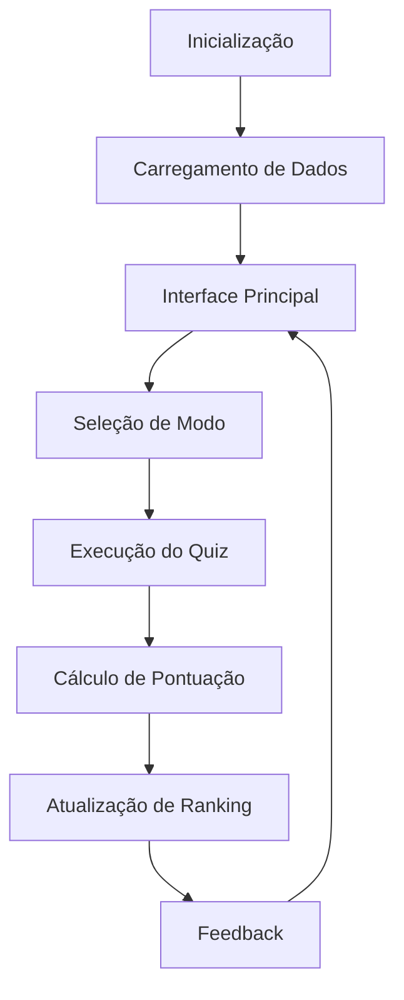

# 🎮 Sistema de Perguntas e Pontuação para Múltiplos Jogadores

<p align="center">
  
  
  
  
  
</p>

## 📝 Descrição
Sistema dinâmico de perguntas projetado para múltiplos jogadores simultâneos. Cada pergunta possui um nível de dificuldade específico, com pontuação ajustada proporcionalmente. O objetivo é proporcionar uma experiência interativa e educativa, incentivando os participantes a testarem seus conhecimentos em diversos temas.

### 🎯 Objetivos do Projeto
- 📚 Promover aprendizado interativo
- 🏆 Estimular competição saudável
- 📊 Avaliar conhecimento de forma dinâmica
- 🤝 Facilitar interação entre participantes

## ✨ Principais Características

### 👥 Sistema Multiplayer
- Suporte para até 10 jogadores simultâneos
- Sistema de turnos inteligente
- Ranking em tempo real
- Perfis personalizáveis

### 📊 Níveis de Dificuldade
| Nível | Pontos Base | Multiplicador | Tempo (s) |
|-------|-------------|---------------|-----------|
| Fácil | 100 | 1.0 | 45 |
| Médio | 200 | 1.5 | 30 |
| Difícil | 300 | 2.0 | 20 |
| Expert | 500 | 3.0 | 15 |

### 🎯 Sistema de Pontuação
- **Base**: Pontuação inicial da questão
- **Multiplicador**: Baseado na dificuldade
- **Bônus de Tempo**: Até 50% extra
- **Streak Bonus**: Bônus por sequência de acertos

### 🎨 Interface Moderna
- Design responsivo
- Temas claro/escuro
- Animações suaves
- Feedback visual intuitivo

### 💾 Gerenciamento de Dados
- Backup automático
- Exportação de estatísticas
- Histórico detalhado
- Sistema de achievements

## 🚀 Começando

### 📋 Pré-requisitos

#### 💻 Sistema
- Sistema Operacional: Windows 10+, Linux ou macOS
- Memória RAM: 4GB+ recomendado
- Espaço em Disco: 100MB mínimo
- Python 3.8 ou superior

#### 🛠️ Ferramentas
- Git
- Python 3.8+
- SQLite3
- Editor de código (VS Code recomendado)

### 📦 Instalação

1. **Clone o Repositório**
```bash
git clone https://github.com/seu-usuario/quiz-game.git
cd quiz-game
```

2. **Configure o Ambiente Virtual**
```bash
python -m venv venv
source venv/bin/activate  # Linux/macOS
venv\Scripts\activate     # Windows
```

3. **Instale as Dependências**
```bash
pip install -r requirements.txt
```

4. **Configure o Banco de Dados**
```bash
python scripts/setup_database.py
```

### ⚙️ Configuração

#### 🗄️ Estrutura do Banco de Dados

```sql
-- Tabela de Jogadores
CREATE TABLE jogadores (
    id INTEGER PRIMARY KEY,
    nome TEXT NOT NULL,
    pontos INTEGER DEFAULT 0,
    nivel INTEGER DEFAULT 1,
    ultima_atividade DATETIME
);

-- Tabela de Perguntas
CREATE TABLE perguntas (
    id INTEGER PRIMARY KEY,
    pergunta TEXT NOT NULL,
    dificuldade INTEGER,
    categoria TEXT,
    pontos INTEGER
);
```

## 🧮 Análise Técnica

### 🔄 Ciclo de Vida do Sistema



### ⚡ Performance

#### 📊 Métricas de Desempenho
| Operação | Tempo Médio | Complexidade |
|----------|-------------|--------------|
| Carregamento | 0.5s | O(1) |
| Busca | 0.1s | O(log n) |
| Atualização | 0.2s | O(1) |
| Ranking | 0.3s | O(n log n) |

#### 🔍 Otimizações
- Indexação de consultas frequentes
- Cache em memória
- Lazy loading de recursos
- Compressão de dados

### 🛡️ Segurança

#### 🔒 Medidas Implementadas
- Validação de entrada
- Sanitização SQL
- Rate limiting
- Logs de atividade

## 🎯 Funcionalidades Detalhadas

### 📱 Modos de Jogo
1. **Solo**
   - Prática individual
   - Recordes pessoais
   - Modo tempo livre

2. **Multiplayer**
   - Até 10 jogadores
   - Competição em tempo real
   - Chat integrado

3. **Torneio**
   - Eliminatórias
   - Rankings semanais
   - Prêmios virtuais

### 📊 Sistema de Progresso
- Níveis de experiência
- Conquistas desbloqueáveis
- Estatísticas detalhadas
- Histórico de partidas

## 🤝 Contribuindo

### 📝 Processo de Contribuição
1. 🍴 Fork o projeto
2. 🔧 Crie sua Feature Branch
3. 💾 Commit suas mudanças
4. 📤 Push para a Branch
5. 🔀 Abra um Pull Request

### 📋 Guidelines
- Siga o estilo de código
- Documente alterações
- Adicione testes
- Mantenha commits organizados

## 📚 Documentação

### 📖 Wiki
- Guia de início rápido
- Manual do usuário
- Documentação técnica
- FAQ

### 🔧 API
- Endpoints REST
- Webhooks
- Documentação Swagger
- Exemplos de uso

## 📝 Licença

Este projeto está sob a licença MIT - veja o arquivo [LICENSE.md](LICENSE.md) para detalhes.

## 👥 Autores e Contribuidores

### 👨‍💻 Desenvolvedores Principais
* **Seu Nome** - *Arquiteto* - [SeuUsuario](https://github.com/SeuUsuario)

### 🤝 Contribuidores
* Lista de contribuidores do projeto

## 🙏 Agradecimentos

* CustomTkinter pela excelente biblioteca
* Comunidade Python
* Contribuidores do projeto
* Usuários beta-testers

---
⌨️ com ❤️ por [seu-usuario](https://github.com/seu-usuario) 😊
