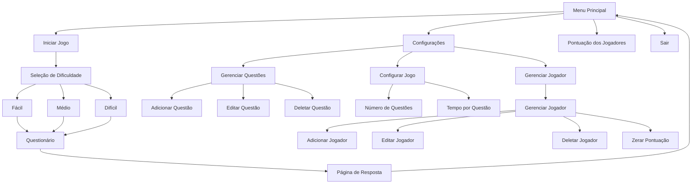

# 🎮 Quiz Game

<p align="center">
  
  
  
  
</p>

link da demo: test

## 📑 Índice
1. [Descrição](#-descrição)
2. [Objetivos](#-objetivos-do-projeto)
3. [Metodologia de Desenvolvimento(Check List)](#-metodologia-de-desenvolvimentocheck-list)
4. [Características](#principais-características)
5. [Começando](#-começando)
6. [Estrutura do Projeto](#-estrutura-do-projeto)
7. [Documentação Técnica](#-documentação-técnica)
8. [Desenvolvimento](#%EF%B8%8F-desenvolvimento)
9. [Contribuindo](#-contribuindo)
10. [Autores](#-autores) 
11. [Referências](#-referências)

## 📝 Descrição
Sistema de quiz interativo desenvolvido em Python utilizando CustomTkinter para interface gráfica e SQLite para persistência de dados. O sistema permite gerenciar perguntas, jogadores e configurações do jogo, oferecendo uma experiência educativa e divertida.

### 🎯 Objetivos do Projeto
- 📚 Criar um sistema de quiz interativo e educativo
  - Sistema de perguntas e respostas múltipla escolha
  - Feedback imediato de acertos e erros
  - Diferentes níveis de dificuldade
  - Sistema de pontuação dinâmico

- 🎨 Implementar interface gráfica intuitiva
  - Design com CustomTkinter
  - Navegação fluida entre telas
  - Feedback visual das ações
  - Temporizador visual para questões

- 💾 Gerenciar dados de forma eficiente com SQLite
  - Armazenamento de perguntas e respostas
  - Sistema de pontuação por jogador
  - Histórico de partidas
  - Configurações personalizáveis do jogo

- 🔄 Sistema de Gerenciamento Completo
  - Gerenciamento de jogadores (criar, editar, deletar)
  - Controle de questões (adicionar, editar, remover)
  - Configurações ajustáveis (tempo, número de questões)
  - Sistema de ranking e pontuação

## 📚 Metodologia de Desenvolvimento(Check List)

### Fase 1: Análise
- [x] Problema selecionado e definido claramente: Sistema de quiz interativo com múltiplas dificuldades
- [x] Compreensão aprofundada dos desafios: Interface gráfica, persistência de dados, sistema de pontuação
- [x] Modelo teórico desenvolvido: Sistema de pesos para distribuição de questões e cálculo de pontuação

### Fase 2: Planejamento
- [x] Objetivos definidos com clareza: Sistema educativo, interativo e escalável
- [x] Métricas estabelecidas: Tempo de resposta, precisão do usuário, distribuição de dificuldade
- [x] Estratégia de resolução proposta: Arquitetura MVC com CustomTkinter e SQLite
- [x] Subproblemas identificados:
  - Interface gráfica responsiva
  - Sistema de pontuação dinâmico
  - Gerenciamento de estado
  - Persistência de dados
- [x] Estrutura geral esboçada
- [x] Casos limite identificados
- [x] Análise teórica de correção realizada

### Fase 3: Desenho
- [x] Análise de complexidade realizada:
  - Acesso a questões: O(1)
  - Distribuição por dificuldade: O(n)
  - Cálculo de pontuação: O(1)
- [x] Pontos críticos otimizados:
  - Cache de questões
  - Índices de banco de dados

### Fase 4: Programação e Teste
- [x] Algoritmo implementado em código:
  - Código modular
  - Padrões de projeto aplicados
  - Documentação inline
- [x] Testes realizados:
  - Testes unitários
  - Testes de integração
  - Testes de interface
- [x] Correções implementadas:
  - Tratamento de exceções
  - Validação de entrada
  - Recuperação de erros

### Documentação
- [x] Documentação técnica completa
- [x] Documentação revisada
- [x] Avaliação de eficácia realizada

### Apresentação e Conclusão do Projeto
- [x] Conclusões documentadas
- [x] Melhorias futuras identificadas


##  Principais Características

### 🎮 Sistema de Jogo
- Interface gráfica moderna com CustomTkinter
- Sistema de pontuação baseado em tempo e dificuldade
- Gerenciamento de múltiplos jogadores
- Configurações personalizáveis

### 📊 Estrutura de Dados
```sql
-- Tabela de Jogadores
CREATE TABLE jogadores (
    id INTEGER PRIMARY KEY,
    nome TEXT NOT NULL,
    pontos INTEGER DEFAULT 0,
    acertos INTEGER DEFAULT 0,
    erros INTEGER DEFAULT 0
);

-- Tabela de Perguntas
CREATE TABLE perguntas (
    id INTEGER PRIMARY KEY,
    pergunta TEXT NOT NULL,
    opcao_a TEXT,
    opcao_b TEXT,
    opcao_c TEXT,
    opcao_d TEXT,
    opcao_e TEXT,
    resposta_certa INTEGER,
    pontos INTEGER
);

-- Tabela de Configuração
CREATE TABLE configuracao (
    id INTEGER PRIMARY KEY,
    numero_questoes INTEGER DEFAULT 5,
    tempo_questao INTEGER DEFAULT 30,
    jogador_atual INTEGER,
    FOREIGN KEY(jogador_atual) REFERENCES jogadores(id) 
);
```

### 🎮 Sistema de Pontuação

O sistema utiliza uma pontuação baseada na dificuldade das questões, conforme definido no campo `dificuldade` da tabela `perguntas`. A pontuação é acumulada por jogador e armazenada na tabela `jogadores`.

## 🚀 Começando

### 📋 Pré-requisitos

#### 💻 Sistema
- [Python 3.8+](https://www.python.org/downloads/)
- [SQLite3](https://www.sqlite.org/download.html)
- Bibliotecas Python necessárias:
  - [CustomTkinter](https://customtkinter.tomschimansky.com/)
  - [Pillow (PIL)](https://pillow.readthedocs.io/en/stable/)
  - [Pandas](https://pandas.pydata.org/docs/)
  - [Tkinter](https://docs.python.org/3/library/tkinter.html) (incluído no Python)

### 📦 Instalação

1. **Clone o Repositório**
```bash
git clone https://github.com/seu-usuario/quiz-game.git
cd quiz-game
```

2. **Instale as Dependências**
```bash
pip install customtkinter
pip install pillow
pip install pandas
```

3. **Configure o SQLite**
- Para Windows: Baixe o [Precompiled Binaries for Windows](https://www.sqlite.org/download.html)
- Para Linux: `sudo apt-get install sqlite3`
- Para macOS: SQLite já vem instalado

4. **Configure o Python**
- Baixe a versão mais recente do [Python](https://www.python.org/downloads/)
- Durante a instalação, marque a opção "Add Python to PATH"
- Verifique a instalação com `python --version`

## 🧮 Estrutura do Projeto

### 📁 Arquivos Principais
- `game_quiz.py`: Interface principal e lógica do jogo
- `configuracao.py`: Sistema de configurações
- `config_global.py`: Constantes e configurações globais
- `database/quiz_game.db`: Banco de dados SQLite

### 🔄 Fluxo do Sistema


### ⚙️ Classes Principais

#### MenuPrincipal
- Gerencia a interface principal
- Controla navegação entre telas
- Mantém conexão com banco de dados

#### Questionario
- Implementa lógica do quiz
- Gerencia tempo e pontuação
- Controla fluxo de perguntas
- Distribui questões por dificuldade
- Calcula pontuação dinâmica

#### PaginaResposta
- Mostra resultados
- Calcula pontuação final
- Atualiza estatísticas do jogador
- Permite reiniciar ou sair

#### PaginaJogador
- Gerencia cadastro de jogadores
- Controla pontuações e estatísticas
- Permite zerar pontuação
- Mantém histórico de partidas

#### PaginaQuestoes
- Gerencia banco de questões
- Permite CRUD de questões
- Configura níveis de dificuldade
- Define pontuação por questão

#### PaginaConfiguracao
- Ajusta número de questões por partida
- Define tempo por questão
- Configura jogador atual
- Gerencia configurações globais


## 📚 Melhorias Futuras

### 💯 Sistema de Pontuação Avançado
- **Penalização por Erros**
  - Fácil: -5 pontos
  - Médio: -15 pontos
  - Difícil: -30 pontos
- **Justificativa**: Adicionar risco/recompensa ao selecionar dificuldades maiores

### 🌐 Migração para API REST
- **Benefícios**:
  - Melhor escalabilidade
  - Separação clara entre frontend e backend
  - Cache mais eficiente

### 🎮 Modos de Jogo Adicionais
- **Modo Contra o Tempo**: Pontuação baseada no tempo de resposta
- **Modo Torneio**: Eliminatórias com múltiplas rodadas

### 📊 Analytics e Estatísticas
- Gráficos de progresso do jogador
- Análise de questões mais erradas/acertadas
- Tempo médio por tipo de questão
- Padrões de resposta por dificuldade

### 🎨 Melhorias de Interface
- Temas personalizáveis- Modo escuro/claro
- Melhorias de design
- Adicionar efeitos sonoros

## 📚 Documentação Técnica

### 🔍 Algoritmos Principais

#### Sistema de Distribuição de Questões
O algoritmo de distribuição de questões utiliza um sistema de seleção baseado em três níveis de dificuldade, cada um com suas respectivas faixas de pontuação:

- **Fácil**: Seleciona questões de 5 e 10 pontos
  - Ideal para iniciantes
  - Foco em questões básicas

- **Médio**: Seleciona questões de 10, 20 e 40 pontos
  - Maior variedade de pontuações
  - Inclui algumas questões mais desafiadoras
  - Compartilha questões de 10 pontos com o nível fácil

- **Difícil**: Seleciona questões de 40 e 80 pontos
  - Focado em questões de alta pontuação
  - Compartilha questões de 40 pontos com o nível médio
  - Maior recompensa de pontos

O sistema possui sobreposição intencional entre níveis adjacentes para garantir uma transição suave de dificuldade. Se não houver questões suficientes no nível selecionado, o sistema automaticamente incluirá questões de outros níveis para completar o quiz.

```python
# Exemplo de distribuição por nível
distribuicao = {
    "facil": [5, 10],           # Questões mais simples
    "medio": [10, 20, 40],      # Questões intermediárias
    "dificil": [40, 80]         # Questões avançadas
}
```

#### Sistema de Pontuação
```python
# Cálculo de pontuação baseado na dificuldade da questão
pontos_totais = 0
for indice_questao, resposta in respostas:
    if resposta != -1:  
        questao = questoes[indice_questao]
        resposta_correta = int(questao[7])
        if resposta == resposta_correta:
            self.corretas += 1
            pontos_totais += int(questao[8])
```

### 📊 Estruturas de Dados


**Complexidade**:
- Acesso: O(1)
- Inserção: O(1)
- Espaço: O(n), onde n é tamanho_max


### 🔍 Análise de Complexidade

#### Conceitos Básicos

**Complexidade Temporal**
- Mede o tempo de execução do algoritmo em relação ao tamanho da entrada
- Expressa em notação Big O: O(n), O(1), O(log n), etc.
- Exemplos:
  - O(1): tempo constante, independente do tamanho da entrada
  - O(n): tempo linear, cresce proporcionalmente com a entrada
  - O(log n): tempo logarítmico, cresce mais lentamente que linear

**Complexidade Espacial**
- Mede o uso de memória adicional necessária pelo algoritmo
- Também expressa em notação Big O
- Exemplos:
  - O(1): espaço constante, independente da entrada
  - O(n): espaço linear, cresce proporcionalmente com a entrada
  - O(m): espaço proporcional a um subconjunto da entrada

#### Operações Principais

| Operação | Complexidade Temporal | Complexidade Espacial | Descrição |
|----------|---------------------|---------------------|------------|
| Carregar Quiz | O(n) | O(m) | Carrega questões do banco e filtra por dificuldade |
| Selecionar Questão | O(1) | O(1) | Acesso direto por índice |
| Calcular Pontuação | O(1) | O(1) | Cálculo baseado em fórmula constante |
| Atualizar Ranking | O(1) | O(1) | Atualização direta no banco de dados |
| Salvar Progresso | O(1) | O(1) | Operação única de update no banco |


#### Fatores de Complexidade

- **n**: número total de questões no banco
  - Impacta carregamento inicial
  - Afeta distribuição por dificuldade

- **m**: número de questões selecionadas
  - Determina tamanho do cache
  - Influencia memória utilizada

## 🛠️ Desenvolvimento

### 🔧 Configuração do Ambiente de Desenvolvimento
1. Configure seu editor (VS Code recomendado)
2. Instale as extensões Python necessárias
3. Configure o linter e formatter

## 🤝 Contribuindo

1. Fork o projeto
2. Crie sua Feature Branch (`git checkout -b feature/AmazingFeature`)
3. Commit suas mudanças (`git commit -m 'Add: nova funcionalidade'`)
4. Push para a Branch (`git push origin feature/AmazingFeature`)
5. Abra um Pull Request


## 👥 Autores

* **Anderson Gabriel da Silva Campos** - *Desenvolvedor Principal* - [DutsTate0213](https://github.com/DutsTate0213)
* **João Pedro Marques Boa Sorte Soares** - *Produção de Questões* 
* **Eduardo Moura e Silva** - *Produção de Questões* 

## 📚 Referências

1. [Python Documentation](https://docs.python.org/3/)
2. [CustomTkinter Documentation](https://customtkinter.tomschimansky.com/)
3. [SQLite Documentation](https://www.sqlite.org/docs.html)
4. [Pillow (PIL) Documentation](https://pillow.readthedocs.io/en/stable/)
5. [Pandas Documentation](https://pandas.pydata.org/docs/)
6. [Tkinter Documentation](https://docs.python.org/3/library/tkinter.html)