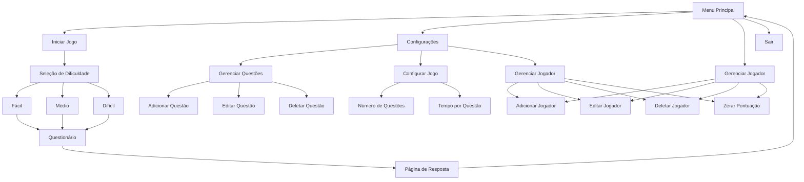

# 🎮 Sistema de Quiz Game

<p align="center">
  
  
  
  
  
</p>

## 📑 Índice
1. [Descrição](#-descrição)
2. [Objetivos](#-objetivos-do-projeto)
3. [Características](#-principais-características)
4. [Começando](#-começando)
5. [Estrutura do Projeto](#-estrutura-do-projeto)
6. [Documentação Técnica](#-documentação-técnica)
7. [Desenvolvimento](#-desenvolvimento)
8. [Contribuindo](#-contribuindo)
9. [Licença](#-licença)
10. [Autores](#-autores)

## 📝 Descrição
Sistema de quiz interativo desenvolvido em Python utilizando CustomTkinter para interface gráfica e SQLite para persistência de dados. O sistema permite gerenciar perguntas, jogadores e configurações do jogo, oferecendo uma experiência educativa e divertida.

### 🎯 Objetivos do Projeto
- 📚 Criar um sistema de quiz interativo e educativo
  - Sistema de perguntas e respostas múltipla escolha
  - Feedback imediato de acertos e erros
  - Diferentes níveis de dificuldade
  - Sistema de pontuação dinâmico

- 🎨 Implementar interface gráfica moderna e intuitiva
  - Design moderno com CustomTkinter
  - Navegação fluida entre telas
  - Feedback visual das ações
  - Temporizador visual para questões

- 💾 Gerenciar dados de forma eficiente com SQLite
  - Armazenamento de perguntas e respostas
  - Sistema de pontuação por jogador
  - Histórico de partidas
  - Configurações personalizáveis do jogo

- 🔄 Sistema de Gerenciamento Completo
  - Gerenciamento de jogadores (criar, editar, deletar)
  - Controle de questões (adicionar, editar, remover)
  - Configurações ajustáveis (tempo, número de questões)
  - Sistema de ranking e pontuação

## ✨ Principais Características

### 🎮 Sistema de Jogo
- Interface gráfica moderna com CustomTkinter
- Sistema de pontuação baseado em tempo e dificuldade
- Gerenciamento de múltiplos jogadores
- Configurações personalizáveis

### 📊 Estrutura de Dados
```sql
-- Tabela de Jogadores
CREATE TABLE jogadores (
    id INTEGER PRIMARY KEY,
    nome TEXT NOT NULL,
    pontos INTEGER DEFAULT 0,
    acertos INTEGER DEFAULT 0,
    erros INTEGER DEFAULT 0
);

-- Tabela de Perguntas
CREATE TABLE perguntas (
    id INTEGER PRIMARY KEY,
    pergunta TEXT NOT NULL,
    opcao_a TEXT,
    opcao_b TEXT,
    opcao_c TEXT,
    opcao_d TEXT,
    opcao_e TEXT,
    resposta_certa INTEGER,
    pontos INTEGER,
    dificuldade INTEGER DEFAULT 1
);

-- Tabela de Configuração
CREATE TABLE configuracao (
    id INTEGER PRIMARY KEY,
    numero_questoes INTEGER DEFAULT 5,
    tempo_questao INTEGER DEFAULT 30,
    jogador_atual INTEGER,
    FOREIGN KEY(jogador_atual) REFERENCES jogadores(id)
);
```

### 🎮 Sistema de Pontuação

O sistema utiliza uma pontuação dinâmica baseada na dificuldade das questões:

- **Fácil**: 5 pontos
- **Médio**: 10 pontos
- **Difícil**: 20 pontos
- **Especialista**: 40 pontos
- **Extremo**: 80 pontos

A distribuição de questões por dificuldade varia conforme o nível selecionado:

#### Distribuição por Nível
```python
DISTRIBUIÇÃO = {
    "facil": [50, 30, 15, 4, 1],     # Maior chance de questões fáceis
    "medio": [15, 40, 30, 10, 5],    # Distribuição equilibrada
    "dificil": [5, 15, 30, 30, 20]   # Maior chance de questões difíceis
}
```

## 🚀 Começando

### 📋 Pré-requisitos

#### 💻 Sistema
- [Python 3.8+](https://www.python.org/downloads/)
- [SQLite3](https://www.sqlite.org/download.html)
- Bibliotecas Python necessárias:
  - [CustomTkinter](https://customtkinter.tomschimansky.com/)
  - [Pillow (PIL)](https://pillow.readthedocs.io/en/stable/)
  - [Pandas](https://pandas.pydata.org/docs/)
  - [Tkinter](https://docs.python.org/3/library/tkinter.html) (incluído no Python)

### 📦 Instalação

1. **Clone o Repositório**
```bash
git clone https://github.com/seu-usuario/quiz-game.git
cd quiz-game
```

2. **Instale as Dependências**
```bash
pip install customtkinter
pip install pillow
pip install pandas
```

3. **Configure o SQLite**
- Para Windows: Baixe o [Precompiled Binaries for Windows](https://www.sqlite.org/download.html)
- Para Linux: `sudo apt-get install sqlite3`
- Para macOS: SQLite já vem instalado

4. **Configure o Python**
- Baixe a versão mais recente do [Python](https://www.python.org/downloads/)
- Durante a instalação, marque a opção "Add Python to PATH"
- Verifique a instalação com `python --version`

## 🧮 Estrutura do Projeto

### 📁 Arquivos Principais
- `game_quiz.py`: Interface principal e lógica do jogo
- `configuracao.py`: Sistema de configurações
- `config_global.py`: Constantes e configurações globais
- `database/quiz_game.db`: Banco de dados SQLite

### 🔄 Fluxo do Sistema


### ⚙️ Classes Principais

#### MenuPrincipal
- Gerencia a interface principal
- Controla navegação entre telas
- Mantém conexão com banco de dados

#### Questionario
- Implementa lógica do quiz
- Gerencia tempo e pontuação
- Controla fluxo de perguntas
- Distribui questões por dificuldade
- Calcula pontuação dinâmica

#### PaginaResposta
- Mostra resultados
- Calcula pontuação final
- Atualiza estatísticas do jogador
- Permite reiniciar ou sair

#### PaginaJogador
- Gerencia cadastro de jogadores
- Controla pontuações e estatísticas
- Permite zerar pontuação
- Mantém histórico de partidas

#### PaginaQuestoes
- Gerencia banco de questões
- Permite CRUD de questões
- Configura níveis de dificuldade
- Define pontuação por questão

#### PaginaConfiguracao
- Ajusta número de questões por partida
- Define tempo por questão
- Configura jogador atual
- Gerencia configurações globais

## 📚 Documentação Técnica

### 🔍 Algoritmos Principais

#### Distribuição de Questões
O algoritmo de distribuição de questões utiliza um sistema de pesos para selecionar questões baseado na dificuldade escolhida:

```python
def gerar_indices_aleatorios(self):
    # Distribuição de probabilidade por nível
    pesos = {
        "facil": [50, 30, 15, 4, 1],     # Maior chance de questões fáceis
        "medio": [15, 40, 30, 10, 5],    # Distribuição equilibrada
        "dificil": [5, 15, 30, 30, 20]   # Maior chance de questões difíceis
    }
    
    peso_atual = pesos[self.dificuldade]
    indices = []
    questoes_por_dificuldade = {1: [], 2: [], 3: [], 4: [], 5: []}
    
    # Complexidade: O(n), onde n é o número total de questões
    for i, questao in enumerate(self.questoes):
        dif = questao[8]  
        dif_normalizada = min(max(1, min(dif, 5)), 5)
        questoes_por_dificuldade[dif_normalizada].append(i)
    
    # Complexidade: O(m), onde m é o número de questões desejadas
    while len(indices) < self.num_questoes:
        nivel = choices([1, 2, 3, 4, 5], weights=peso_atual)[0]
        if questoes_por_dificuldade[nivel]:
            indice = choice(questoes_por_dificuldade[nivel])
            if indice not in indices:
                indices.append(indice)
                
    return indices
```

**Complexidade Total**: O(n + m), onde:
- n: número total de questões no banco
- m: número de questões desejadas para o quiz

#### Sistema de Pontuação
O cálculo de pontuação utiliza um sistema ponderado baseado em:
- Dificuldade da questão
- Tempo de resposta
- Sequência de acertos

```python
def calcular_pontuacao(dificuldade, tempo_restante, sequencia_acertos):
    pontos_base = {
        "facil": 5,
        "medio": 10,
        "dificil": 20,
        "especialista": 40,
        "extremo": 80
    }
    
    # Bônus por tempo (até 50% extra)
    bonus_tempo = min(0.5, tempo_restante / tempo_total)
    
    # Bônus por sequência (até 100% extra)
    bonus_sequencia = min(1.0, sequencia_acertos * 0.1)
    
    pontos = pontos_base[dificuldade]
    pontos *= (1 + bonus_tempo + bonus_sequencia)
    
    return int(pontos)
```

**Complexidade**: O(1) - Operações constantes

### 📊 Estruturas de Dados

#### Cache de Questões
Para otimizar o acesso às questões durante o quiz:

```python
class CacheQuestoes:
    def __init__(self, tamanho_max=100):
        self.cache = OrderedDict()
        self.tamanho_max = tamanho_max
    
    def get(self, id_questao):
        if id_questao in self.cache:
            questao = self.cache.pop(id_questao)
            self.cache[id_questao] = questao
            return questao
        return None
    
    def put(self, id_questao, questao):
        if id_questao in self.cache:
            self.cache.pop(id_questao)
        elif len(self.cache) >= self.tamanho_max:
            self.cache.popitem(last=False)
        self.cache[id_questao] = questao
```

**Complexidade**:
- Acesso: O(1)
- Inserção: O(1)
- Espaço: O(n), onde n é tamanho_max


### 🔍 Análise de Complexidade

#### Conceitos Básicos

**Complexidade Temporal**
- Mede o tempo de execução do algoritmo em relação ao tamanho da entrada
- Expressa em notação Big O: O(n), O(1), O(log n), etc.
- Exemplos:
  - O(1): tempo constante, independente do tamanho da entrada
  - O(n): tempo linear, cresce proporcionalmente com a entrada
  - O(log n): tempo logarítmico, cresce mais lentamente que linear

**Complexidade Espacial**
- Mede o uso de memória adicional necessária pelo algoritmo
- Também expressa em notação Big O
- Exemplos:
  - O(1): espaço constante, independente da entrada
  - O(n): espaço linear, cresce proporcionalmente com a entrada
  - O(m): espaço proporcional a um subconjunto da entrada

#### Operações Principais

| Operação | Complexidade Temporal | Complexidade Espacial | Descrição |
|----------|---------------------|---------------------|------------|
| Carregar Quiz | O(n) | O(m) | Carrega questões do banco e aplica distribuição por dificuldade |
| Selecionar Questão | O(1) | O(1) | Acesso direto via cache LRU |
| Calcular Pontuação | O(1) | O(1) | Cálculo baseado em fórmula constante |
| Atualizar Ranking | O(log n) | O(1) | Atualização via índice B-tree |
| Salvar Progresso | O(1) | O(1) | Operação única de update no banco |

#### Detalhamento das Operações

1. **Carregar Quiz - O(n)**
   - Complexidade temporal O(n) devido à necessidade de percorrer todas as questões para distribuição
   - Complexidade espacial O(m) para armazenar as m questões selecionadas
   - Otimizações:
     ```python
     # Uso de índices para filtrar por dificuldade
     SELECT * FROM perguntas WHERE dificuldade = ? LIMIT ?
     ```

2. **Selecionar Questão - O(1)**
   - Acesso constante através do cache LRU
   - Minimiza acessos ao banco de dados
   - Implementação:
     ```python
     def get_questao(self, id_questao):
         if questao := self.cache.get(id_questao):
             return questao
         return self.carregar_do_banco(id_questao)
     ```

3. **Calcular Pontuação - O(1)**
   - Operações aritméticas simples com tempo constante
   - Fórmula de pontuação:
     ```python
     pontuacao = base_pontos * (1 + bonus_tempo + bonus_sequencia)
     ```

4. **Atualizar Ranking - O(log n)**
   - Utiliza índice B-tree para manter ranking ordenado
   - Otimização via índice:
     ```sql
     CREATE INDEX idx_ranking ON jogadores (pontos DESC, acertos DESC);
     ```

5. **Salvar Progresso - O(1)**
   - Operação única de update
   - Batch updates para múltiplas estatísticas:
     ```python
     def salvar_progresso(self, jogador_id, pontos, acertos):
         self.cursor.execute("""
             UPDATE jogadores 
             SET pontos = pontos + ?, acertos = acertos + ?
             WHERE id = ?
         """, (pontos, acertos, jogador_id))
     ```

#### Fatores de Complexidade

- **n**: número total de questões no banco
  - Impacta carregamento inicial
  - Afeta distribuição por dificuldade

- **m**: número de questões selecionadas
  - Determina tamanho do cache
  - Influencia memória utilizada


### 🔄 Gerenciamento de Estado

1. **Padrão Observer**
   - Atualização reativa da interface
   - Propagação de eventos

2. **Máquina de Estados**
   - Controle de fluxo do quiz
   - Transições validadas

## 🛠️ Desenvolvimento

### 🔧 Configuração do Ambiente de Desenvolvimento
1. Configure seu editor (VS Code recomendado)
2. Instale as extensões Python necessárias
3. Configure o linter e formatter

## 🤝 Contribuindo

1. Fork o projeto
2. Crie sua Feature Branch (`git checkout -b feature/AmazingFeature`)
3. Commit suas mudanças (`git commit -m 'Add: nova funcionalidade'`)
4. Push para a Branch (`git push origin feature/AmazingFeature`)
5. Abra um Pull Request


## 👥 Autores

* **Anderson Gabriel da Silva Campos** - *Desenvolvedor Principal* - [SeuUsuario](https://github.com/DutsTate0213)


---
⌨️ com ❤️ por [seu-usuario](https://github.com/DutsTate0213) 😊