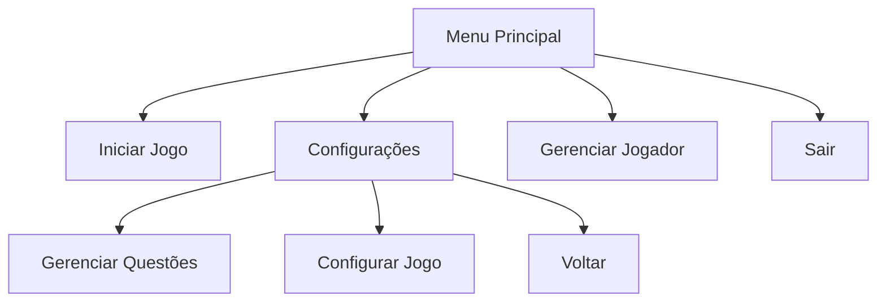

# 🎮 Sistema de Quiz Game

<p align="center">
  
  
  
  
  
</p>

## 📝 Descrição
Sistema de quiz interativo desenvolvido em Python utilizando CustomTkinter para interface gráfica e SQLite para persistência de dados. O sistema permite gerenciar perguntas, jogadores e configurações do jogo, oferecendo uma experiência educativa e divertida.

### 🎯 Objetivos do Projeto
- 📚 Criar um sistema de quiz interativo e educativo
- 🎨 Implementar interface gráfica moderna e intuitiva
- 💾 Gerenciar dados de forma eficiente com SQLite
- 🔄 Permitir configurações flexíveis do jogo

## ✨ Principais Características

### 🎮 Sistema de Jogo
- Interface gráfica moderna com CustomTkinter
- Sistema de pontuação baseado em tempo e dificuldade
- Gerenciamento de múltiplos jogadores
- Configurações personalizáveis

### 📊 Estrutura de Dados
```sql
-- Tabela de Jogadores
CREATE TABLE jogadores (
    id INTEGER PRIMARY KEY,
    nome TEXT NOT NULL,
    pontos INTEGER DEFAULT 0,
    acertos INTEGER DEFAULT 0,
    erros INTEGER DEFAULT 0
);

-- Tabela de Perguntas
CREATE TABLE perguntas (
    id INTEGER PRIMARY KEY,
    pergunta TEXT NOT NULL,
    opcao_a TEXT,
    opcao_b TEXT,
    opcao_c TEXT,
    opcao_d TEXT,
    opcao_e TEXT,
    resposta_certa INTEGER,
    pontos INTEGER
);

-- Tabela de Configuração
CREATE TABLE configuracao (
    id INTEGER PRIMARY KEY,
    numero_questoes INTEGER DEFAULT 5,
    tempo_questao INTEGER DEFAULT 30
);
```

## 🚀 Começando

### 📋 Pré-requisitos

#### 💻 Sistema
- [Python 3.8+](https://www.python.org/downloads/)
- [SQLite3](https://www.sqlite.org/download.html)
- Bibliotecas Python necessárias

### 📦 Instalação

1. **Clone o Repositório**
```bash
git clone https://github.com/seu-usuario/quiz-game.git
cd quiz-game
```

2. **Instale as Dependências**
```bash
pip install customtkinter
pip install pillow
pip install pandas
```

3. **Configure o SQLite**
- Para Windows: Baixe o [Precompiled Binaries for Windows](https://www.sqlite.org/download.html)
- Para Linux: `sudo apt-get install sqlite3`
- Para macOS: SQLite já vem instalado

4. **Configure o Python**
- Baixe a versão mais recente do [Python](https://www.python.org/downloads/)
- Durante a instalação, marque a opção "Add Python to PATH"
- Verifique a instalação com `python --version`

## 🧮 Estrutura do Projeto

### 📁 Arquivos Principais
- `game_quiz.py`: Arquivo principal com a interface do jogo
- `configuracao.py`: Gerenciamento de configurações
- `main.py`: Implementação do quiz

### 🔄 Fluxo do Sistema


### ⚙️ Classes Principais

#### MenuPrincipal
- Gerencia a interface principal
- Controla navegação entre telas
- Mantém conexão com banco de dados

#### Questionario
- Implementa lógica do quiz
- Gerencia tempo e pontuação
- Controla fluxo de perguntas

#### PaginaResposta
- Mostra resultados
- Calcula pontuação final
- Permite reiniciar ou sair

## 🛠️ Desenvolvimento

### 🔧 Configuração do Ambiente de Desenvolvimento
1. Configure seu editor (VS Code recomendado)
2. Instale as extensões Python necessárias
3. Configure o linter e formatter

### 📝 Guidelines de Código
- Use PEP 8 para estilo de código
- Documente funções e classes
- Mantenha commits organizados

## 🤝 Contribuindo

1. Fork o projeto
2. Crie sua Feature Branch (`git checkout -b feature/AmazingFeature`)
3. Commit suas mudanças (`git commit -m 'Add: nova funcionalidade'`)
4. Push para a Branch (`git push origin feature/AmazingFeature`)
5. Abra um Pull Request

## 📝 Licença

Este projeto está sob a licença MIT - veja o arquivo [LICENSE.md](LICENSE.md) para detalhes.

## 👥 Autores

* **Seu Nome** - *Desenvolvedor Principal* - [SeuUsuario](https://github.com/SeuUsuario)

## 🙏 Agradecimentos

* CustomTkinter pela biblioteca
* Comunidade Python
* Contribuidores do projeto

---
⌨️ com ❤️ por [seu-usuario](https://github.com/seu-usuario) 😊